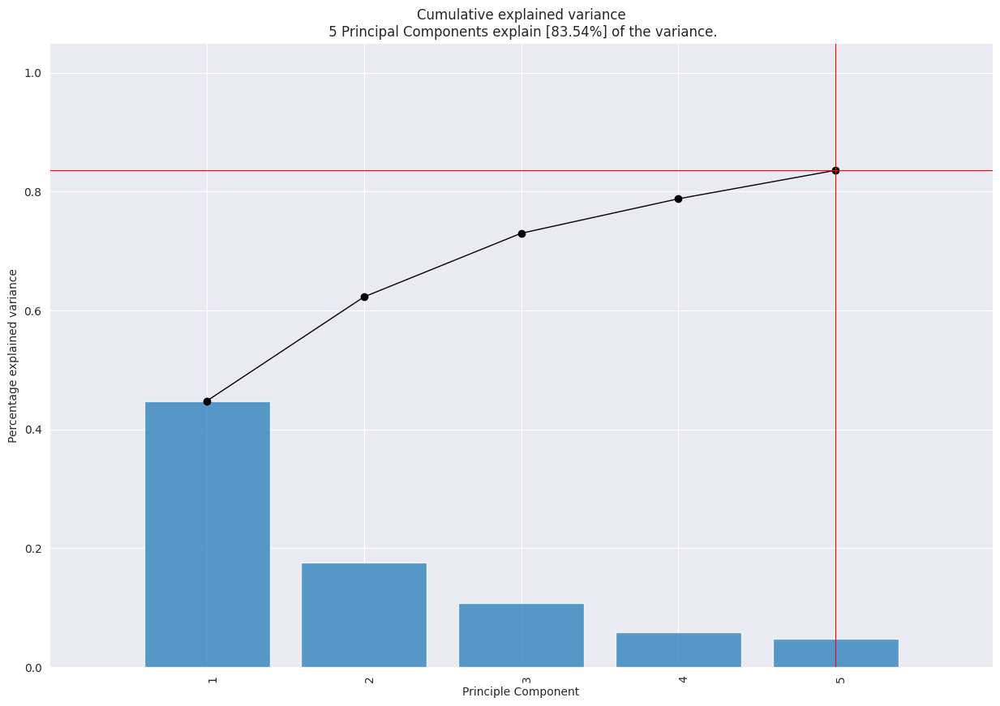
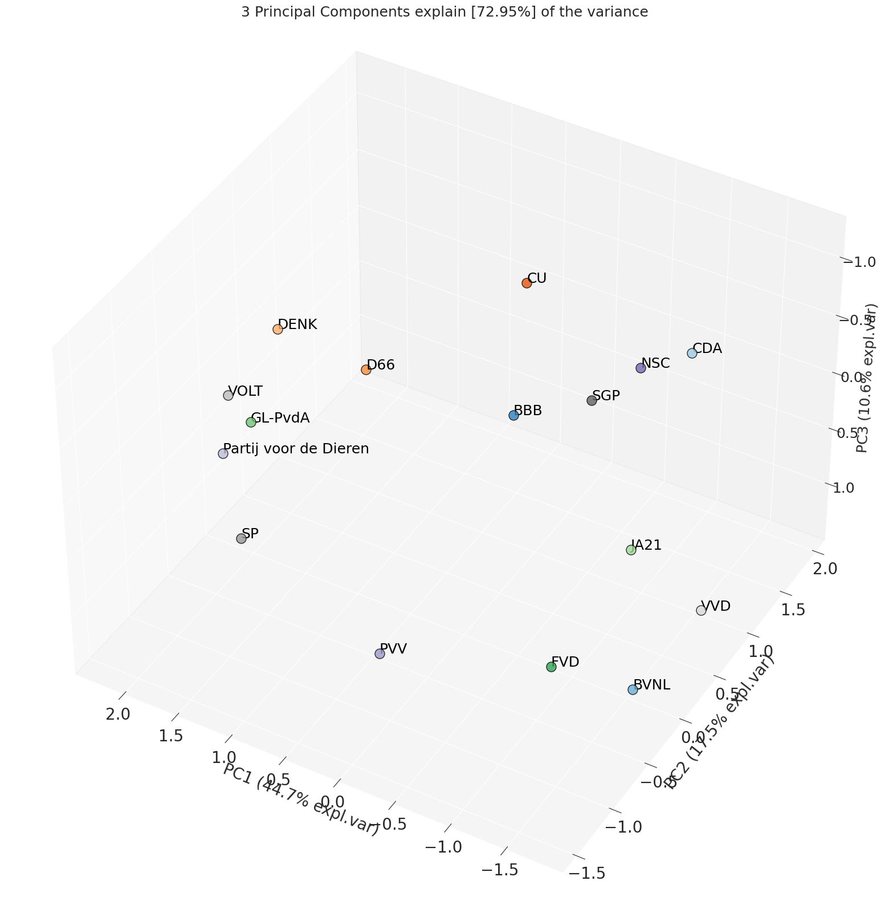
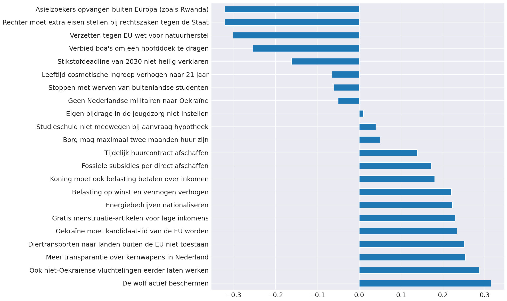
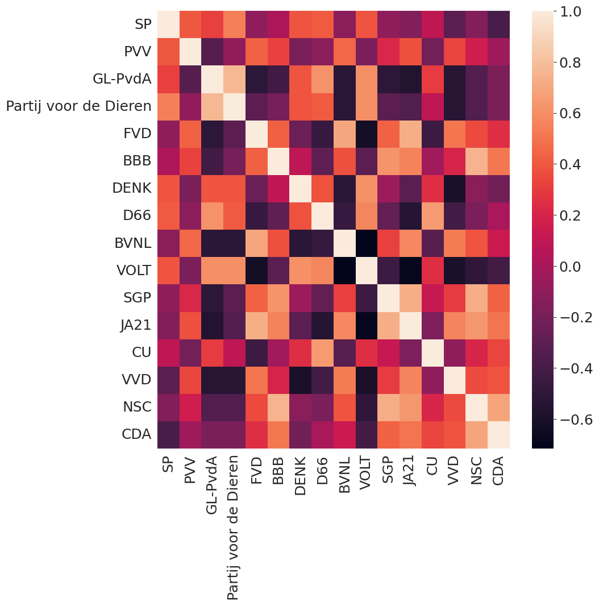
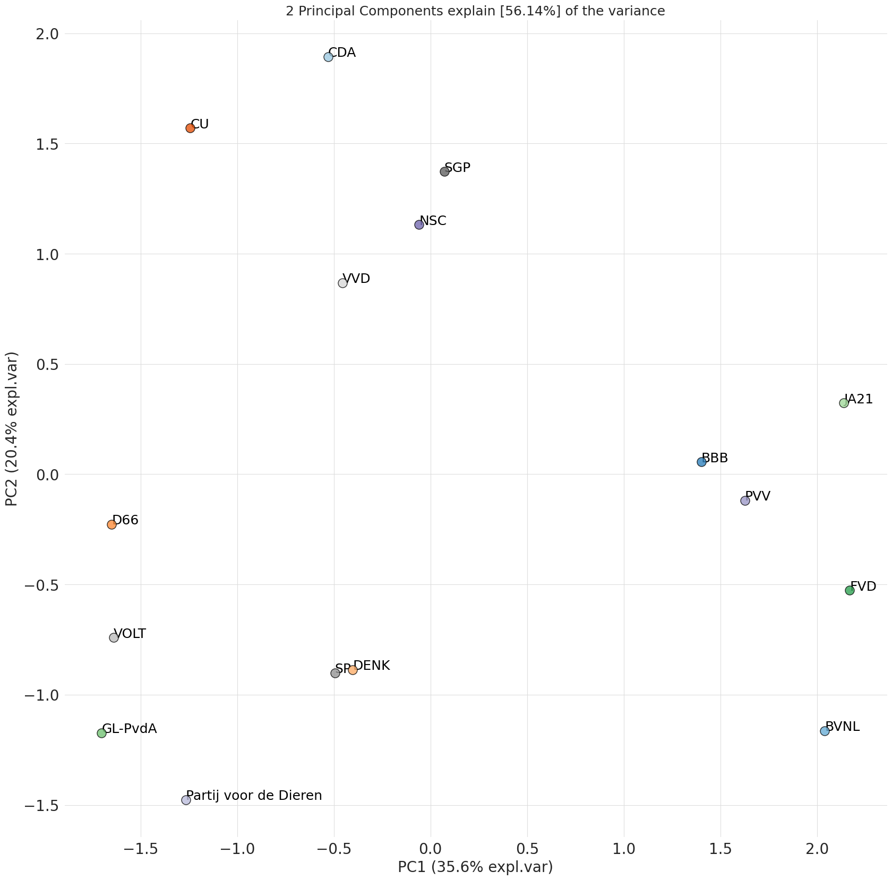
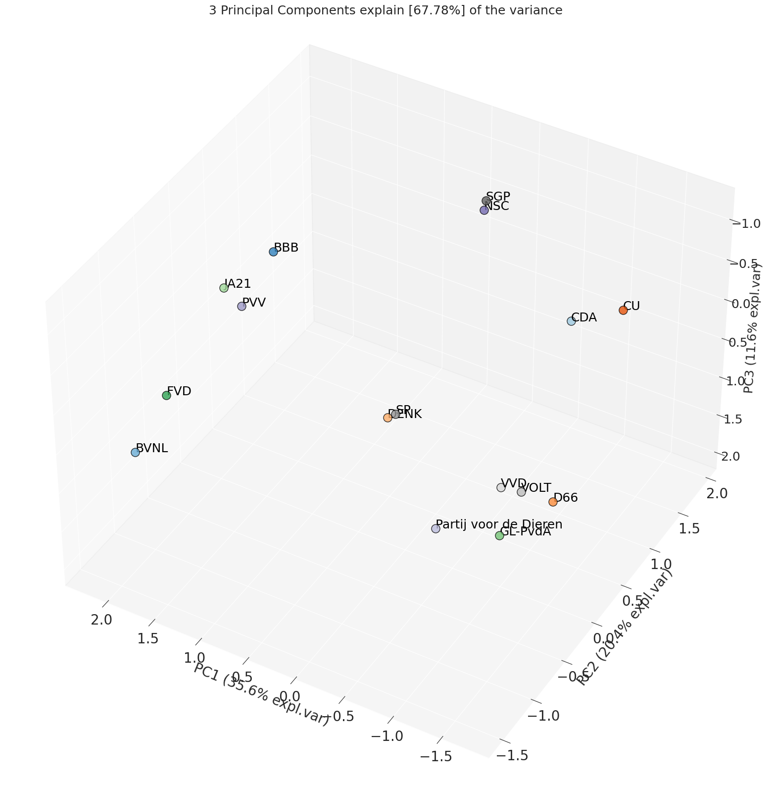
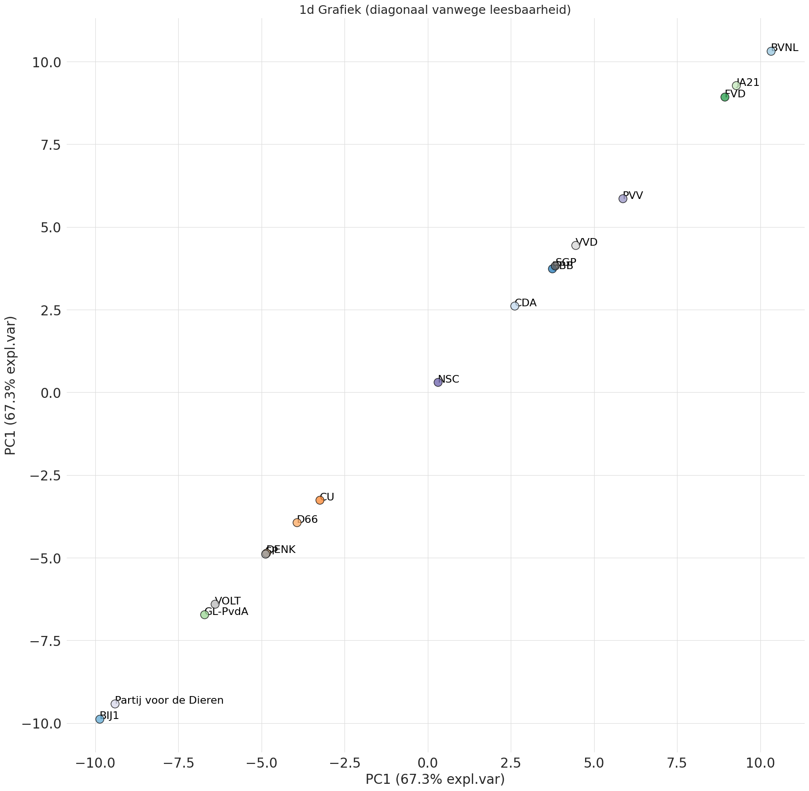

```python
import pandas as pd
from pca import pca
import seaborn as sns
import matplotlib.pyplot as plt
```

# 1. Hoofdcomponentenanalyse

Hoofdcomponentenanalyse (PCA) is een statistische techniek die wordt gebruikt voor dimensionale reductie. Dit is een techniek  waarmee de dimensies of variabelen van een dataset worden verminderd, terwijl zo veel mogelijk relevante informatie behouden blijft. Het doel is om de complexiteit van gegevens te verminderen door de dataset om te zetten in een lagere dimensionale ruimte, terwijl belangrijke patronen en relaties in de gegevens behouden blijven.

De overgebleven dimensies, de 'hoofdcomponenten' zijn een combinatie van de oorspronkelijke variabelen en kunnen worden gebruikt om de belangrijkste patronen in de data te identificeren. Het is hierdoor mogelijk om de data te visualiseren in een grafiek met minder dimensies. Niet elk component verklaard evenveel van de variantie in de data. De eerste component verklaard de meeste variantie, de tweede component verklaard de meeste variantie van de overgebleven variantie, etc. De toegevoegde waarde van een component neemt hierdoor af naarmate er meer componenten worden toegevoegd omdat elk nieuw component een kleiner deel van de variantie verklaard.


# 2. Analyze stemhulpen

Dit is een analyse van hoe de verschillende partijen zich tot elkaar verhouden op basis van de stellingen van de stemhulpen. Het doel is om hierdoor een beter beeld te kunnen geven van het antwoord op vragen als; "Waar bevindt de NSC zich op het politieke spectrum?", "hoeveel overlap is er tussen de partijen?".

Elke vraag in een stemhulp representeert een dimensie, dit betekent dat een stemhulp met 30 vragen een 30 dimensionale dataset oplevert. Om deze data alsnog te kunnen visualiseren is er een hoofdcomponentenanalyse toegepast op de data van alle stemhulpen om het aantal dimensies terug te brengen tot 1, 2 of 3 dimensies. Hierdoor is het mogelijk de posities van de partijen in een grafiek te visualiseren. Partijen die zich dicht bij elkaar bevinden zijn het met elkaar eens, partijen die ver van elkaar af staan zijn het oneens. Het is belangrijk de beseffen dat niet elke as ('component') evenveel van de variantie verklaard. In de grafieken staat per as aangegeven welk deel van de variantie verklaard wordt en dus ook hoe 'belangrijk' deze as is. 

Per component is er analyse van de stellingen die de grootste invloed hebben op de positie van de partijen. Hierdoor wordt inzichtelijk gemaakt wat een as in de grafiek representeert. De antwoorden van de partijen op de stellingen zijn gecodeerd als nummer. Hoe hoger het nummer, hoe meer de partij het eens is met de stelling, negatieve nummers betekenen dat de partij het oneens is met de stelling. Deze antwoorden worden vermenigvuldigt met de waardes ('loadings') die de stellingen hebben voor de component. De som van deze vermenigvuldigingen is de positie van de partij op de component.

Als laatste heb ik de corrolatie tussen de antwoorden van de partijen berekend. Hoe hoger de correlatie, hoe meer de partijen het met elkaar eens zijn. 
 


## 2.1 Check je stem

[Check je stem](https://checkjestem.nl/) is een stemhulp die niet de standpunten maar het stemgedrag van de partijen volgt. Het probleem met deze checker is dat bij de gekozen stemmingen BIJ1 (7) en NSC (3) niet altijd aanwezig waren. Deze stemmingen kunnen hierdoor *of* niet meegenomen worden in de analyse, *of* de analyse moet zonder de partijen plaatsvinden. Gezien het grote aantal gemiste stemmingen (7) en het feit dat de partij in de peilingen stabiel op 0 zetels staat is er besloten om BIJ1 weg te laten uit de analyse. NSC is wel meegenomen gezien het grote aantal zetels in de peilingen. 

Van de 26 stellingen blijven er hierdoor 23 over. Het stemgedrag van Groenlinks en de PvdA had 100% overlap en zijn daarom samengevoegd tot de 'GL-PvdA' combinatie waarmee ze in de verkiezingen ook op de lijst staan.


```python
# Load data and prepare DataFrame for analysis
check_je_stem_df = pd.read_csv('data/check_je_stem.csv')
check_je_stem_df = check_je_stem_df.drop("BIJ1", axis=1)
check_je_stem_df = check_je_stem_df.dropna(axis=0)
check_je_stem_labels = check_je_stem_df.columns[1:]
check_je_stem_df =check_je_stem_df.iloc[1:]
check_je_stem_questions = check_je_stem_df["vraag"]
check_je_stem_df = check_je_stem_df.iloc[:, 1:]

# Prepared DataFrame is assigned its own variable to allow the original to be used in the Merged model.
check_je_stem_prepared = pd.DataFrame(data=check_je_stem_df, columns=check_je_stem_labels)
check_je_stem_prepared = check_je_stem_prepared.rename(index=check_je_stem_questions)
check_je_stem_prepared = check_je_stem_prepared.transpose()
```

### Verklaarde variantie per component


```python
model = pca(n_components=5)
results = model.fit_transform(check_je_stem_prepared, row_labels=check_je_stem_labels)
model.plot()
```

    [pca] >Extracting column labels from dataframe.
    [pca] >The PCA reduction is performed on the [22] columns of the input dataframe.
    [pca] >Fit using PCA.
    [pca] >Compute loadings and PCs.
    [pca] >Compute explained variance.
    [pca] >Outlier detection using Hotelling T2 test with alpha=[0.05] and n_components=[5]
    [pca] >Multiple test correction applied for Hotelling T2 test: [fdr_bh]
    [pca] >Outlier detection using SPE/DmodX with n_std=[3]


    (<Figure size 1500x1000 with 1 Axes>,
     <Axes: title={'center': 'Cumulative explained variance\n 5 Principal Components explain [83.54%] of the variance.'}, xlabel='Principle Component', ylabel='Percentage explained variance'>)


    

    


### Visualisatie van de posities van de partijen

#### 1d


```python
model = pca(n_components=2)
results = model.fit_transform(check_je_stem_prepared, row_labels=check_je_stem_labels)
model.scatter(legend=False, figsize=(20,20), labels=check_je_stem_labels, PC=(0,0), fontsize=16, title="1d Grafiek (diagonaal vanwege leesbaarheid)")

```

    [scatterd] >INFO> Create scatterplot


    [pca] >Extracting column labels from dataframe.
    [pca] >The PCA reduction is performed on the [22] columns of the input dataframe.
    [pca] >Fit using PCA.
    [pca] >Compute loadings and PCs.
    [pca] >Compute explained variance.
    [pca] >Outlier detection using Hotelling T2 test with alpha=[0.05] and n_components=[2]
    [pca] >Multiple test correction applied for Hotelling T2 test: [fdr_bh]
    [pca] >Outlier detection using SPE/DmodX with n_std=[3]


    (<Figure size 2000x2000 with 1 Axes>,
     <Axes: title={'center': '1d Grafiek (diagonaal vanwege leesbaarheid)'}, xlabel='PC1 (44.7% expl.var)', ylabel='PC1 (44.7% expl.var)'>)


    

    


#### 2d


```python
model = pca(n_components=2)
results = model.fit_transform(check_je_stem_prepared, row_labels=check_je_stem_labels)
model.scatter(legend=False, figsize=(20,20), labels=check_je_stem_labels)
```

    [scatterd] >INFO> Create scatterplot


    [pca] >Extracting column labels from dataframe.
    [pca] >The PCA reduction is performed on the [22] columns of the input dataframe.
    [pca] >Fit using PCA.
    [pca] >Compute loadings and PCs.
    [pca] >Compute explained variance.
    [pca] >Outlier detection using Hotelling T2 test with alpha=[0.05] and n_components=[2]
    [pca] >Multiple test correction applied for Hotelling T2 test: [fdr_bh]
    [pca] >Outlier detection using SPE/DmodX with n_std=[3]


    (<Figure size 2000x2000 with 1 Axes>,
     <Axes: title={'center': '2 Principal Components explain [62.25%] of the variance'}, xlabel='PC1 (44.7% expl.var)', ylabel='PC2 (17.5% expl.var)'>)


    

    


#### 3d


```python
model = pca(n_components=3)
results = model.fit_transform(check_je_stem_prepared, row_labels=check_je_stem_labels)
model.scatter3d(legend=False, figsize=(20,20), labels=check_je_stem_labels)
```

    [scatterd] >INFO> Create scatterplot


    [pca] >Extracting column labels from dataframe.
    [pca] >The PCA reduction is performed on the [22] columns of the input dataframe.
    [pca] >Fit using PCA.
    [pca] >Compute loadings and PCs.
    [pca] >Compute explained variance.
    [pca] >Outlier detection using Hotelling T2 test with alpha=[0.05] and n_components=[3]
    [pca] >Multiple test correction applied for Hotelling T2 test: [fdr_bh]
    [pca] >Outlier detection using SPE/DmodX with n_std=[3]


    (<Figure size 2000x2000 with 1 Axes>,
     <Axes3D: title={'center': '3 Principal Components explain [72.95%] of the variance'}, xlabel='PC1 (44.7% expl.var)', ylabel='PC2 (17.5% expl.var)', zlabel='PC3 (10.6% expl.var)'>)


    

    


### Analyse componenten


```python
component_df = model.results["loadings"].iloc[0].sort_values(ascending=False)
fig, ax = plt.subplots(figsize=(20,12))
component_df.plot.barh(ax=ax)
fig.tight_layout()
```


    

    


```python
component_df = model.results["loadings"].iloc[1].sort_values(ascending=False)
fig, ax = plt.subplots(figsize=(20,12))
component_df.plot.barh(ax=ax)
fig.tight_layout()
```


    

    


### Correlatie stemgedrag van de partijen


```python
fig, ax = plt.subplots(figsize=(10,10))  
sns.heatmap(check_je_stem_df.corr())
```


    <Axes: >


    

    


```python
check_je_stem_df.corr()
```


<div>
<style scoped>
    .dataframe tbody tr th:only-of-type {
        vertical-align: middle;
    }

    .dataframe tbody tr th {
        vertical-align: top;
    }

    .dataframe thead th {
        text-align: right;
    }
</style>
<table border="1" class="dataframe">
  <thead>
    <tr style="text-align: right;">
      <th></th>
      <th>SP</th>
      <th>PVV</th>
      <th>GL-PvdA</th>
      <th>Partij voor de Dieren</th>
      <th>FVD</th>
      <th>BBB</th>
      <th>DENK</th>
      <th>D66</th>
      <th>BVNL</th>
      <th>VOLT</th>
      <th>SGP</th>
      <th>JA21</th>
      <th>CU</th>
      <th>VVD</th>
      <th>NSC</th>
      <th>CDA</th>
    </tr>
  </thead>
  <tbody>
    <tr>
      <th>SP</th>
      <td>1.000000</td>
      <td>0.398527</td>
      <td>0.312500</td>
      <td>0.541667</td>
      <td>-0.094356</td>
      <td>0.019920</td>
      <td>0.385758</td>
      <td>4.082483e-01</td>
      <td>-0.113228</td>
      <td>0.385758</td>
      <td>-0.094356</td>
      <td>-0.149071</td>
      <td>0.094356</td>
      <td>-0.312500</td>
      <td>-0.149071</td>
      <td>-3.857584e-01</td>
    </tr>
    <tr>
      <th>PVV</th>
      <td>0.398527</td>
      <td>1.000000</td>
      <td>-0.332106</td>
      <td>-0.088561</td>
      <td>0.431187</td>
      <td>0.328139</td>
      <td>-0.184482</td>
      <td>-1.084652e-01</td>
      <td>0.451243</td>
      <td>-0.184482</td>
      <td>0.210580</td>
      <td>0.376256</td>
      <td>-0.210580</td>
      <td>0.332106</td>
      <td>0.158424</td>
      <td>-4.099600e-02</td>
    </tr>
    <tr>
      <th>GL-PvdA</th>
      <td>0.312500</td>
      <td>-0.332106</td>
      <td>1.000000</td>
      <td>0.770833</td>
      <td>-0.509525</td>
      <td>-0.418330</td>
      <td>0.385758</td>
      <td>6.123724e-01</td>
      <td>-0.528396</td>
      <td>0.597925</td>
      <td>-0.509525</td>
      <td>-0.559017</td>
      <td>0.301941</td>
      <td>-0.541667</td>
      <td>-0.354044</td>
      <td>-1.735913e-01</td>
    </tr>
    <tr>
      <th>Partij voor de Dieren</th>
      <td>0.541667</td>
      <td>-0.088561</td>
      <td>0.770833</td>
      <td>1.000000</td>
      <td>-0.301941</td>
      <td>-0.199205</td>
      <td>0.385758</td>
      <td>4.082483e-01</td>
      <td>-0.528396</td>
      <td>0.597925</td>
      <td>-0.301941</td>
      <td>-0.354044</td>
      <td>0.094356</td>
      <td>-0.541667</td>
      <td>-0.354044</td>
      <td>-1.735913e-01</td>
    </tr>
    <tr>
      <th>FVD</th>
      <td>-0.094356</td>
      <td>0.431187</td>
      <td>-0.509525</td>
      <td>-0.301941</td>
      <td>1.000000</td>
      <td>0.424043</td>
      <td>-0.244600</td>
      <td>-4.622502e-01</td>
      <td>0.692308</td>
      <td>-0.628971</td>
      <td>0.435897</td>
      <td>0.725797</td>
      <td>-0.435897</td>
      <td>0.509525</td>
      <td>0.354459</td>
      <td>2.445998e-01</td>
    </tr>
    <tr>
      <th>BBB</th>
      <td>0.019920</td>
      <td>0.328139</td>
      <td>-0.418330</td>
      <td>-0.199205</td>
      <td>0.424043</td>
      <td>1.000000</td>
      <td>0.092214</td>
      <td>-2.927700e-01</td>
      <td>0.369910</td>
      <td>-0.313527</td>
      <td>0.622532</td>
      <td>0.552340</td>
      <td>-0.027067</td>
      <td>0.199205</td>
      <td>0.748331</td>
      <td>5.163978e-01</td>
    </tr>
    <tr>
      <th>DENK</th>
      <td>0.385758</td>
      <td>-0.184482</td>
      <td>0.385758</td>
      <td>0.385758</td>
      <td>-0.244600</td>
      <td>0.092214</td>
      <td>1.000000</td>
      <td>3.779645e-01</td>
      <td>-0.524142</td>
      <td>0.607143</td>
      <td>-0.052414</td>
      <td>-0.310530</td>
      <td>0.244600</td>
      <td>-0.597925</td>
      <td>-0.120761</td>
      <td>-2.142857e-01</td>
    </tr>
    <tr>
      <th>D66</th>
      <td>0.408248</td>
      <td>-0.108465</td>
      <td>0.612372</td>
      <td>0.408248</td>
      <td>-0.462250</td>
      <td>-0.292770</td>
      <td>0.377964</td>
      <td>1.000000e+00</td>
      <td>-0.462250</td>
      <td>0.566947</td>
      <td>-0.277350</td>
      <td>-0.547723</td>
      <td>0.647150</td>
      <td>-0.408248</td>
      <td>-0.182574</td>
      <td>1.573593e-17</td>
    </tr>
    <tr>
      <th>BVNL</th>
      <td>-0.113228</td>
      <td>0.451243</td>
      <td>-0.528396</td>
      <td>-0.528396</td>
      <td>0.692308</td>
      <td>0.369910</td>
      <td>-0.524142</td>
      <td>-4.622502e-01</td>
      <td>1.000000</td>
      <td>-0.716328</td>
      <td>0.316239</td>
      <td>0.573886</td>
      <td>-0.316239</td>
      <td>0.528396</td>
      <td>0.388217</td>
      <td>1.397713e-01</td>
    </tr>
    <tr>
      <th>VOLT</th>
      <td>0.385758</td>
      <td>-0.184482</td>
      <td>0.597925</td>
      <td>0.597925</td>
      <td>-0.628971</td>
      <td>-0.313527</td>
      <td>0.607143</td>
      <td>5.669467e-01</td>
      <td>-0.716328</td>
      <td>1.000000</td>
      <td>-0.436785</td>
      <td>-0.690066</td>
      <td>0.244600</td>
      <td>-0.597925</td>
      <td>-0.500298</td>
      <td>-4.107143e-01</td>
    </tr>
    <tr>
      <th>SGP</th>
      <td>-0.094356</td>
      <td>0.210580</td>
      <td>-0.509525</td>
      <td>-0.301941</td>
      <td>0.435897</td>
      <td>0.622532</td>
      <td>-0.052414</td>
      <td>-2.773501e-01</td>
      <td>0.316239</td>
      <td>-0.436785</td>
      <td>1.000000</td>
      <td>0.725797</td>
      <td>0.128205</td>
      <td>0.301941</td>
      <td>0.725797</td>
      <td>4.367853e-01</td>
    </tr>
    <tr>
      <th>JA21</th>
      <td>-0.149071</td>
      <td>0.376256</td>
      <td>-0.559017</td>
      <td>-0.354044</td>
      <td>0.725797</td>
      <td>0.552340</td>
      <td>-0.310530</td>
      <td>-5.477226e-01</td>
      <td>0.573886</td>
      <td>-0.690066</td>
      <td>0.725797</td>
      <td>1.000000</td>
      <td>-0.168790</td>
      <td>0.559017</td>
      <td>0.633333</td>
      <td>5.002975e-01</td>
    </tr>
    <tr>
      <th>CU</th>
      <td>0.094356</td>
      <td>-0.210580</td>
      <td>0.301941</td>
      <td>0.094356</td>
      <td>-0.435897</td>
      <td>-0.027067</td>
      <td>0.244600</td>
      <td>6.471502e-01</td>
      <td>-0.316239</td>
      <td>0.244600</td>
      <td>0.128205</td>
      <td>-0.168790</td>
      <td>1.000000</td>
      <td>-0.094356</td>
      <td>0.202548</td>
      <td>3.319569e-01</td>
    </tr>
    <tr>
      <th>VVD</th>
      <td>-0.312500</td>
      <td>0.332106</td>
      <td>-0.541667</td>
      <td>-0.541667</td>
      <td>0.509525</td>
      <td>0.199205</td>
      <td>-0.597925</td>
      <td>-4.082483e-01</td>
      <td>0.528396</td>
      <td>-0.597925</td>
      <td>0.301941</td>
      <td>0.559017</td>
      <td>-0.094356</td>
      <td>1.000000</td>
      <td>0.354044</td>
      <td>3.857584e-01</td>
    </tr>
    <tr>
      <th>NSC</th>
      <td>-0.149071</td>
      <td>0.158424</td>
      <td>-0.354044</td>
      <td>-0.354044</td>
      <td>0.354459</td>
      <td>0.748331</td>
      <td>-0.120761</td>
      <td>-1.825742e-01</td>
      <td>0.388217</td>
      <td>-0.500298</td>
      <td>0.725797</td>
      <td>0.633333</td>
      <td>0.202548</td>
      <td>0.354044</td>
      <td>1.000000</td>
      <td>6.900656e-01</td>
    </tr>
    <tr>
      <th>CDA</th>
      <td>-0.385758</td>
      <td>-0.040996</td>
      <td>-0.173591</td>
      <td>-0.173591</td>
      <td>0.244600</td>
      <td>0.516398</td>
      <td>-0.214286</td>
      <td>1.573593e-17</td>
      <td>0.139771</td>
      <td>-0.410714</td>
      <td>0.436785</td>
      <td>0.500298</td>
      <td>0.331957</td>
      <td>0.385758</td>
      <td>0.690066</td>
      <td>1.000000e+00</td>
    </tr>
  </tbody>
</table>
</div>


## 2.2 StemWijzer

De [StemWijzer](https://www.stemwijzer.nl/) is gemaakt door de organisatie ProDemos en bevat 30 stellingen. Vragen kunnen beantwoord worden met 'ja', 'geen mening' en 'nee' welke ik als '2', '1' en '0' heb gecodeerd.


```python
# Load data and prepare DataFrame for analysis
stemwijzer_df = pd.read_csv('data/stemwijzer.csv')
stemwijzer_labels = stemwijzer_df.columns[1:]
stemwijzer_df =stemwijzer_df.iloc[1:]
stemwijzer_questions = stemwijzer_df["Stelling (0=Nee; 1=Geen mening; 2=Ja)"]
stemwijzer_df = stemwijzer_df.iloc[:, 1:]

# Prepared DataFrame is assigned its own variable to allow the original to be used in the Merged model.
stemwijzer_df_prepared = pd.DataFrame(data=stemwijzer_df, columns=stemwijzer_labels)
stemwijzer_df_prepared = stemwijzer_df_prepared.rename(index=stemwijzer_questions)
stemwijzer_df_prepared = stemwijzer_df_prepared.transpose()
```

### Verklaarde variantie per component


```python
model = pca(n_components=5)
results = model.fit_transform(stemwijzer_df_prepared, row_labels=stemwijzer_labels)
model.plot()
```

    [pca] >Extracting column labels from dataframe.
    [pca] >The PCA reduction is performed on the [29] columns of the input dataframe.
    [pca] >Fit using PCA.
    [pca] >Compute loadings and PCs.
    [pca] >Compute explained variance.
    [pca] >Outlier detection using Hotelling T2 test with alpha=[0.05] and n_components=[5]
    [pca] >Multiple test correction applied for Hotelling T2 test: [fdr_bh]
    [pca] >Outlier detection using SPE/DmodX with n_std=[3]


    (<Figure size 1500x1000 with 1 Axes>,
     <Axes: title={'center': 'Cumulative explained variance\n 5 Principal Components explain [78.03%] of the variance.'}, xlabel='Principle Component', ylabel='Percentage explained variance'>)


    

    


### Visualisatie van de posities van de partijen

#### 1d


```python
model = pca(n_components=2)
results = model.fit_transform(stemwijzer_df_prepared, row_labels=stemwijzer_labels)
model.scatter(legend=False, figsize=(20,20), labels=stemwijzer_labels, PC=(0,0), fontsize=16, title="1d Grafiek (diagonaal vanwege leesbaarheid)")
```

    [scatterd] >INFO> Create scatterplot


    [pca] >Extracting column labels from dataframe.
    [pca] >The PCA reduction is performed on the [29] columns of the input dataframe.
    [pca] >Fit using PCA.
    [pca] >Compute loadings and PCs.
    [pca] >Compute explained variance.
    [pca] >Outlier detection using Hotelling T2 test with alpha=[0.05] and n_components=[2]
    [pca] >Multiple test correction applied for Hotelling T2 test: [fdr_bh]
    [pca] >Outlier detection using SPE/DmodX with n_std=[3]


    (<Figure size 2000x2000 with 1 Axes>,
     <Axes: title={'center': '1d Grafiek (diagonaal vanwege leesbaarheid)'}, xlabel='PC1 (34.8% expl.var)', ylabel='PC1 (34.8% expl.var)'>)


    

    


#### 2d


```python
model = pca(n_components=2)
results = model.fit_transform(stemwijzer_df_prepared, row_labels=stemwijzer_labels)
model.scatter(legend=False, figsize=(20,20), labels=stemwijzer_labels)
```

    [pca] >Extracting column labels from dataframe.
    [pca] >The PCA reduction is performed on the [29] columns of the input dataframe.
    [pca] >Fit using PCA.
    [pca] >Compute loadings and PCs.
    [pca] >Compute explained variance.
    [pca] >Outlier detection using Hotelling T2 test with alpha=[0.05] and n_components=[2]
    [pca] >Multiple test correction applied for Hotelling T2 test: [fdr_bh]
    [pca] >Outlier detection using SPE/DmodX with n_std=[3]


    [scatterd] >INFO> Create scatterplot


    (<Figure size 2000x2000 with 1 Axes>,
     <Axes: title={'center': '2 Principal Components explain [52.81%] of the variance'}, xlabel='PC1 (34.8% expl.var)', ylabel='PC2 (17.9% expl.var)'>)


    

    


#### 3d


```python
model = pca(n_components=3)
results = model.fit_transform(stemwijzer_df_prepared, row_labels=stemwijzer_labels)
model.scatter3d(legend=False, figsize=(20,20), labels=stemwijzer_labels)
```

    [scatterd] >INFO> Create scatterplot


    [pca] >Extracting column labels from dataframe.
    [pca] >The PCA reduction is performed on the [29] columns of the input dataframe.
    [pca] >Fit using PCA.
    [pca] >Compute loadings and PCs.
    [pca] >Compute explained variance.
    [pca] >Outlier detection using Hotelling T2 test with alpha=[0.05] and n_components=[3]
    [pca] >Multiple test correction applied for Hotelling T2 test: [fdr_bh]
    [pca] >Outlier detection using SPE/DmodX with n_std=[3]


    (<Figure size 2000x2000 with 1 Axes>,
     <Axes3D: title={'center': '3 Principal Components explain [63.03%] of the variance'}, xlabel='PC1 (34.8% expl.var)', ylabel='PC2 (17.9% expl.var)', zlabel='PC3 (10.2% expl.var)'>)


    

    


### Analyse componenten


```python
component_df = model.results["loadings"].iloc[0].sort_values(ascending=False)
fig, ax = plt.subplots(figsize=(20,12))
component_df.plot.barh(ax=ax)
fig.tight_layout()
```

    /tmp/ipykernel_13280/279368595.py:4: UserWarning: Tight layout not applied. The left and right margins cannot be made large enough to accommodate all axes decorations.
      fig.tight_layout()


    

    


```python
component_df = model.results["loadings"].iloc[1].sort_values(ascending=False)
fig, ax = plt.subplots(figsize=(20,12))
component_df.plot.barh(ax=ax)
fig.tight_layout()
```

    /tmp/ipykernel_13280/845681879.py:4: UserWarning: Tight layout not applied. The left and right margins cannot be made large enough to accommodate all axes decorations.
      fig.tight_layout()


    

    


### Correlatie standpunten van de partijen


```python
fig, ax = plt.subplots(figsize=(10,10))  
sns.heatmap(stemwijzer_df.corr())
```


    <Axes: >


    

    


```python
stemwijzer_df.corr()
```


<div>
<style scoped>
    .dataframe tbody tr th:only-of-type {
        vertical-align: middle;
    }

    .dataframe tbody tr th {
        vertical-align: top;
    }

    .dataframe thead th {
        text-align: right;
    }
</style>
<table border="1" class="dataframe">
  <thead>
    <tr style="text-align: right;">
      <th></th>
      <th>SGP</th>
      <th>VVD</th>
      <th>CDA</th>
      <th>FVD</th>
      <th>CU</th>
      <th>JA21</th>
      <th>NSC</th>
      <th>BBB</th>
      <th>VOLT</th>
      <th>DENK</th>
      <th>PVV</th>
      <th>BVNL</th>
      <th>SP</th>
      <th>Partij voor de Dieren</th>
      <th>GL-PvdA</th>
      <th>D66</th>
      <th>BIJ1</th>
    </tr>
  </thead>
  <tbody>
    <tr>
      <th>SGP</th>
      <td>1.000000</td>
      <td>0.312527</td>
      <td>0.264683</td>
      <td>0.330086</td>
      <td>0.242056</td>
      <td>0.358273</td>
      <td>0.219330</td>
      <td>0.113996</td>
      <td>0.022939</td>
      <td>-0.264683</td>
      <td>0.027696</td>
      <td>0.164488</td>
      <td>-0.421332</td>
      <td>-0.264683</td>
      <td>-0.312527</td>
      <td>-0.253024</td>
      <td>-0.404716</td>
    </tr>
    <tr>
      <th>VVD</th>
      <td>0.312527</td>
      <td>1.000000</td>
      <td>0.353273</td>
      <td>0.240300</td>
      <td>-0.330514</td>
      <td>0.490025</td>
      <td>0.009855</td>
      <td>0.380019</td>
      <td>0.029053</td>
      <td>-0.064684</td>
      <td>0.127558</td>
      <td>0.318182</td>
      <td>-0.497568</td>
      <td>-0.641863</td>
      <td>-0.267677</td>
      <td>0.063564</td>
      <td>-0.476072</td>
    </tr>
    <tr>
      <th>CDA</th>
      <td>0.264683</td>
      <td>0.353273</td>
      <td>1.000000</td>
      <td>0.028989</td>
      <td>0.217078</td>
      <td>0.273402</td>
      <td>0.650516</td>
      <td>0.226604</td>
      <td>0.257603</td>
      <td>0.137255</td>
      <td>-0.180962</td>
      <td>0.079611</td>
      <td>-0.289216</td>
      <td>-0.289216</td>
      <td>-0.064684</td>
      <td>0.260927</td>
      <td>-0.263048</td>
    </tr>
    <tr>
      <th>FVD</th>
      <td>0.330086</td>
      <td>0.240300</td>
      <td>0.028989</td>
      <td>1.000000</td>
      <td>-0.341309</td>
      <td>0.631187</td>
      <td>0.239237</td>
      <td>0.354436</td>
      <td>-0.410337</td>
      <td>-0.169100</td>
      <td>0.366624</td>
      <td>0.613010</td>
      <td>-0.028989</td>
      <td>-0.449323</td>
      <td>-0.524737</td>
      <td>-0.545205</td>
      <td>-0.349760</td>
    </tr>
    <tr>
      <th>CU</th>
      <td>0.242056</td>
      <td>-0.330514</td>
      <td>0.217078</td>
      <td>-0.341309</td>
      <td>1.000000</td>
      <td>-0.394748</td>
      <td>0.158676</td>
      <td>-0.207762</td>
      <td>0.507557</td>
      <td>0.157640</td>
      <td>-0.174902</td>
      <td>-0.430193</td>
      <td>0.082696</td>
      <td>0.382471</td>
      <td>0.406585</td>
      <td>0.385162</td>
      <td>0.188390</td>
    </tr>
    <tr>
      <th>JA21</th>
      <td>0.358273</td>
      <td>0.490025</td>
      <td>0.273402</td>
      <td>0.631187</td>
      <td>-0.394748</td>
      <td>1.000000</td>
      <td>0.417118</td>
      <td>0.256188</td>
      <td>-0.533440</td>
      <td>-0.344832</td>
      <td>0.418015</td>
      <td>0.670034</td>
      <td>-0.201973</td>
      <td>-0.630550</td>
      <td>-0.562528</td>
      <td>-0.275326</td>
      <td>-0.677076</td>
    </tr>
    <tr>
      <th>NSC</th>
      <td>0.219330</td>
      <td>0.009855</td>
      <td>0.650516</td>
      <td>0.239237</td>
      <td>0.158676</td>
      <td>0.417118</td>
      <td>1.000000</td>
      <td>0.148796</td>
      <td>-0.041231</td>
      <td>-0.228166</td>
      <td>0.022402</td>
      <td>0.275946</td>
      <td>-0.087383</td>
      <td>-0.228166</td>
      <td>-0.295656</td>
      <td>0.005168</td>
      <td>-0.270336</td>
    </tr>
    <tr>
      <th>BBB</th>
      <td>0.113996</td>
      <td>0.380019</td>
      <td>0.226604</td>
      <td>0.354436</td>
      <td>-0.207762</td>
      <td>0.256188</td>
      <td>0.148796</td>
      <td>1.000000</td>
      <td>-0.149049</td>
      <td>0.273402</td>
      <td>0.131340</td>
      <td>0.417521</td>
      <td>-0.298033</td>
      <td>-0.512321</td>
      <td>-0.307515</td>
      <td>-0.180929</td>
      <td>-0.335421</td>
    </tr>
    <tr>
      <th>VOLT</th>
      <td>0.022939</td>
      <td>0.029053</td>
      <td>0.257603</td>
      <td>-0.410337</td>
      <td>0.507557</td>
      <td>-0.533440</td>
      <td>-0.041231</td>
      <td>-0.149049</td>
      <td>1.000000</td>
      <td>0.195154</td>
      <td>-0.533654</td>
      <td>-0.565213</td>
      <td>-0.182143</td>
      <td>0.270613</td>
      <td>0.430512</td>
      <td>0.617731</td>
      <td>0.234474</td>
    </tr>
    <tr>
      <th>DENK</th>
      <td>-0.264683</td>
      <td>-0.064684</td>
      <td>0.137255</td>
      <td>-0.169100</td>
      <td>0.157640</td>
      <td>-0.344832</td>
      <td>-0.228166</td>
      <td>0.273402</td>
      <td>0.195154</td>
      <td>1.000000</td>
      <td>-0.037700</td>
      <td>-0.223906</td>
      <td>0.289216</td>
      <td>0.004902</td>
      <td>0.064684</td>
      <td>0.041748</td>
      <td>0.335013</td>
    </tr>
    <tr>
      <th>PVV</th>
      <td>0.027696</td>
      <td>0.127558</td>
      <td>-0.180962</td>
      <td>0.366624</td>
      <td>-0.174902</td>
      <td>0.418015</td>
      <td>0.022402</td>
      <td>0.131340</td>
      <td>-0.533654</td>
      <td>-0.037700</td>
      <td>1.000000</td>
      <td>0.390326</td>
      <td>0.253849</td>
      <td>-0.256362</td>
      <td>-0.349508</td>
      <td>-0.398675</td>
      <td>-0.141233</td>
    </tr>
    <tr>
      <th>BVNL</th>
      <td>0.164488</td>
      <td>0.318182</td>
      <td>0.079611</td>
      <td>0.613010</td>
      <td>-0.430193</td>
      <td>0.670034</td>
      <td>0.275946</td>
      <td>0.417521</td>
      <td>-0.565213</td>
      <td>-0.223906</td>
      <td>0.390326</td>
      <td>1.000000</td>
      <td>-0.079611</td>
      <td>-0.512495</td>
      <td>-0.464646</td>
      <td>-0.524404</td>
      <td>-0.400505</td>
    </tr>
    <tr>
      <th>SP</th>
      <td>-0.421332</td>
      <td>-0.497568</td>
      <td>-0.289216</td>
      <td>-0.028989</td>
      <td>0.082696</td>
      <td>-0.201973</td>
      <td>-0.087383</td>
      <td>-0.298033</td>
      <td>-0.182143</td>
      <td>0.289216</td>
      <td>0.253849</td>
      <td>-0.079611</td>
      <td>1.000000</td>
      <td>0.431373</td>
      <td>0.208979</td>
      <td>-0.260927</td>
      <td>0.550911</td>
    </tr>
    <tr>
      <th>Partij voor de Dieren</th>
      <td>-0.264683</td>
      <td>-0.641863</td>
      <td>-0.289216</td>
      <td>-0.449323</td>
      <td>0.382471</td>
      <td>-0.630550</td>
      <td>-0.228166</td>
      <td>-0.512321</td>
      <td>0.270613</td>
      <td>0.004902</td>
      <td>-0.256362</td>
      <td>-0.512495</td>
      <td>0.431373</td>
      <td>1.000000</td>
      <td>0.641863</td>
      <td>0.193086</td>
      <td>0.550911</td>
    </tr>
    <tr>
      <th>GL-PvdA</th>
      <td>-0.312527</td>
      <td>-0.267677</td>
      <td>-0.064684</td>
      <td>-0.524737</td>
      <td>0.406585</td>
      <td>-0.562528</td>
      <td>-0.295656</td>
      <td>-0.307515</td>
      <td>0.430512</td>
      <td>0.064684</td>
      <td>-0.349508</td>
      <td>-0.464646</td>
      <td>0.208979</td>
      <td>0.641863</td>
      <td>1.000000</td>
      <td>0.550889</td>
      <td>0.403024</td>
    </tr>
    <tr>
      <th>D66</th>
      <td>-0.253024</td>
      <td>0.063564</td>
      <td>0.260927</td>
      <td>-0.545205</td>
      <td>0.385162</td>
      <td>-0.275326</td>
      <td>0.005168</td>
      <td>-0.180929</td>
      <td>0.617731</td>
      <td>0.041748</td>
      <td>-0.398675</td>
      <td>-0.524404</td>
      <td>-0.260927</td>
      <td>0.193086</td>
      <td>0.550889</td>
      <td>1.000000</td>
      <td>-0.058121</td>
    </tr>
    <tr>
      <th>BIJ1</th>
      <td>-0.404716</td>
      <td>-0.476072</td>
      <td>-0.263048</td>
      <td>-0.349760</td>
      <td>0.188390</td>
      <td>-0.677076</td>
      <td>-0.270336</td>
      <td>-0.335421</td>
      <td>0.234474</td>
      <td>0.335013</td>
      <td>-0.141233</td>
      <td>-0.400505</td>
      <td>0.550911</td>
      <td>0.550911</td>
      <td>0.403024</td>
      <td>-0.058121</td>
      <td>1.000000</td>
    </tr>
  </tbody>
</table>
</div>


## 2.3 StemmenTracker

Gemaakt door de organisatie achter de **StemWijzer*, onderscheid de [StemmenTracker](https://www.stemmentracker.nl/) zich door net als **Check je stem** het stemgedrag van de partijen als data te gebruiken. De StemmenTracker loopt in mindere mate tegen het zelfde probleem als **Check je stem** aan, namelijk dat zowel BIJ1 (4) als de NSC (4) niet bij alle stemmingen aanwezig waren.

Omdat de afwezigheid van beide partijen geen overlap heeft, zou ik van de 30 stellingen er 8 moeten weggooien om beide partijen mee te nemen. Ik heb er daarom voor gekozen om ook hier BIJ1 weg te laten maar NSC wel mee te nemen. Hierdoor blijven er 26 stellingen over.

Het stemgedrag van Groenlinks en de PvdA had 100% overlap en zijn daarom samengevoegd tot de 'GL-PvdA' combinatie waarmee ze in de verkiezingen ook op de lijst staan.


```python
# Load data and prepare DataFrame for analysis
stemmen_tracker_df = pd.read_csv('data/stemmentracker.csv')
stemmen_tracker_df = stemmen_tracker_df.drop("BIJ1", axis=1)
stemmen_tracker_df = stemmen_tracker_df.dropna(axis=0)
stemmen_tracker_labels = stemmen_tracker_df.columns[1:]
stemmen_tracker_df =stemmen_tracker_df.iloc[1:]
stemmen_tracker_questions = stemmen_tracker_df["Motie"]
stemmen_tracker_df = stemmen_tracker_df.iloc[:, 1:]

# Prepared DataFrame is assigned its own variable to allow the original to be used in the Merged model.
stemmen_tracker_df_prepared = pd.DataFrame(data=stemmen_tracker_df, columns=stemmen_tracker_labels)
stemmen_tracker_df_prepared = stemmen_tracker_df_prepared.rename(index=stemmen_tracker_questions)
stemmen_tracker_df_prepared = stemmen_tracker_df_prepared.transpose()
```

### Verklaarde variantie per component


```python
model = pca(n_components=5)
results = model.fit_transform(stemmen_tracker_df_prepared, row_labels=stemmen_tracker_labels)
model.plot()
```

    [pca] >Extracting column labels from dataframe.
    [pca] >The PCA reduction is performed on the [25] columns of the input dataframe.
    [pca] >Fit using PCA.
    [pca] >Compute loadings and PCs.
    [pca] >Compute explained variance.
    [pca] >Outlier detection using Hotelling T2 test with alpha=[0.05] and n_components=[5]
    [pca] >Multiple test correction applied for Hotelling T2 test: [fdr_bh]
    [pca] >Outlier detection using SPE/DmodX with n_std=[3]


    (<Figure size 1500x1000 with 1 Axes>,
     <Axes: title={'center': 'Cumulative explained variance\n 5 Principal Components explain [79.57%] of the variance.'}, xlabel='Principle Component', ylabel='Percentage explained variance'>)


    

    


### Visualisatie van de posities van de partijen

#### 1d


```python
model = pca(n_components=2)
results = model.fit_transform(stemmen_tracker_df_prepared, row_labels=stemmen_tracker_labels)
model.scatter(legend=False, figsize=(20,20), labels=stemmen_tracker_labels, PC=(0,0), fontsize=16, title="1d Grafiek (diagonaal vanwege leesbaarheid)")

```

    [scatterd] >INFO> Create scatterplot


    [pca] >Extracting column labels from dataframe.
    [pca] >The PCA reduction is performed on the [25] columns of the input dataframe.
    [pca] >Fit using PCA.
    [pca] >Compute loadings and PCs.
    [pca] >Compute explained variance.
    [pca] >Outlier detection using Hotelling T2 test with alpha=[0.05] and n_components=[2]
    [pca] >Multiple test correction applied for Hotelling T2 test: [fdr_bh]
    [pca] >Outlier detection using SPE/DmodX with n_std=[3]


    (<Figure size 2000x2000 with 1 Axes>,
     <Axes: title={'center': '1d Grafiek (diagonaal vanwege leesbaarheid)'}, xlabel='PC1 (35.6% expl.var)', ylabel='PC1 (35.6% expl.var)'>)


    

    


#### 2d


```python
model = pca(n_components=2)
results = model.fit_transform(stemmen_tracker_df_prepared, row_labels=stemmen_tracker_labels)
model.scatter(legend=False, figsize=(20,20), labels=stemmen_tracker_labels)
```

    [scatterd] >INFO> Create scatterplot


    [pca] >Extracting column labels from dataframe.
    [pca] >The PCA reduction is performed on the [25] columns of the input dataframe.
    [pca] >Fit using PCA.
    [pca] >Compute loadings and PCs.
    [pca] >Compute explained variance.
    [pca] >Outlier detection using Hotelling T2 test with alpha=[0.05] and n_components=[2]
    [pca] >Multiple test correction applied for Hotelling T2 test: [fdr_bh]
    [pca] >Outlier detection using SPE/DmodX with n_std=[3]


    (<Figure size 2000x2000 with 1 Axes>,
     <Axes: title={'center': '2 Principal Components explain [56.14%] of the variance'}, xlabel='PC1 (35.6% expl.var)', ylabel='PC2 (20.4% expl.var)'>)


    

    


#### 3d


```python
model = pca(n_components=3)
results = model.fit_transform(stemmen_tracker_df_prepared, row_labels=stemmen_tracker_labels)
model.scatter3d(legend=False, figsize=(20,20), labels=stemmen_tracker_labels)
```

    [pca] >Extracting column labels from dataframe.
    [pca] >The PCA reduction is performed on the [25] columns of the input dataframe.
    [pca] >Fit using PCA.
    [pca] >Compute loadings and PCs.
    [pca] >Compute explained variance.
    [pca] >Outlier detection using Hotelling T2 test with alpha=[0.05] and n_components=[3]
    [pca] >Multiple test correction applied for Hotelling T2 test: [fdr_bh]
    [pca] >Outlier detection using SPE/DmodX with n_std=[3]


    [scatterd] >INFO> Create scatterplot


    (<Figure size 2000x2000 with 1 Axes>,
     <Axes3D: title={'center': '3 Principal Components explain [67.78%] of the variance'}, xlabel='PC1 (35.6% expl.var)', ylabel='PC2 (20.4% expl.var)', zlabel='PC3 (11.6% expl.var)'>)


    

    


### Analyse componenten


```python
component_df = model.results["loadings"].iloc[0].sort_values(ascending=False)
fig, ax = plt.subplots(figsize=(20,12))
component_df.plot.barh(ax=ax)
fig.tight_layout()
```


    

    


```python
component_df = model.results["loadings"].iloc[1].sort_values(ascending=False)
fig, ax = plt.subplots(figsize=(20,12))
component_df.plot.barh(ax=ax)
fig.tight_layout()
```


    

    


### Correlatie stemgedrag van de partijen


```python
fig, ax = plt.subplots(figsize=(10,10))  
sns.heatmap(stemmen_tracker_df.corr())
```


    <Axes: >


    

    


```python
stemmen_tracker_df.corr()
```


<div>
<style scoped>
    .dataframe tbody tr th:only-of-type {
        vertical-align: middle;
    }

    .dataframe tbody tr th {
        vertical-align: top;
    }

    .dataframe thead th {
        text-align: right;
    }
</style>
<table border="1" class="dataframe">
  <thead>
    <tr style="text-align: right;">
      <th></th>
      <th>PVV</th>
      <th>FVD</th>
      <th>JA21</th>
      <th>BBB</th>
      <th>BVNL</th>
      <th>VVD</th>
      <th>D66</th>
      <th>CDA</th>
      <th>SP</th>
      <th>GL-PvdA</th>
      <th>Partij voor de Dieren</th>
      <th>CU</th>
      <th>SGP</th>
      <th>DENK</th>
      <th>VOLT</th>
      <th>NSC</th>
    </tr>
  </thead>
  <tbody>
    <tr>
      <th>PVV</th>
      <td>1.000000</td>
      <td>0.510355</td>
      <td>0.479167</td>
      <td>0.557370</td>
      <td>0.378726</td>
      <td>-0.068041</td>
      <td>-0.113424</td>
      <td>0.041667</td>
      <td>-0.041667</td>
      <td>-0.329044</td>
      <td>-0.113424</td>
      <td>-0.068041</td>
      <td>0.174595</td>
      <td>0.131944</td>
      <td>-0.386976</td>
      <td>0.174595</td>
    </tr>
    <tr>
      <th>FVD</th>
      <td>0.510355</td>
      <td>1.000000</td>
      <td>0.510355</td>
      <td>0.428412</td>
      <td>0.773906</td>
      <td>-0.098693</td>
      <td>-0.438719</td>
      <td>-0.174595</td>
      <td>-0.161165</td>
      <td>-0.461039</td>
      <td>-0.277425</td>
      <td>-0.427669</td>
      <td>-0.136364</td>
      <td>-0.161165</td>
      <td>-0.529043</td>
      <td>-0.136364</td>
    </tr>
    <tr>
      <th>JA21</th>
      <td>0.479167</td>
      <td>0.510355</td>
      <td>1.000000</td>
      <td>0.378726</td>
      <td>0.557370</td>
      <td>-0.068041</td>
      <td>-0.447024</td>
      <td>0.041667</td>
      <td>-0.215278</td>
      <td>-0.664804</td>
      <td>-0.447024</td>
      <td>-0.238145</td>
      <td>0.174595</td>
      <td>-0.215278</td>
      <td>-0.553777</td>
      <td>0.174595</td>
    </tr>
    <tr>
      <th>BBB</th>
      <td>0.557370</td>
      <td>0.428412</td>
      <td>0.378726</td>
      <td>1.000000</td>
      <td>0.264706</td>
      <td>-0.140028</td>
      <td>-0.199098</td>
      <td>0.157207</td>
      <td>0.200082</td>
      <td>-0.262575</td>
      <td>-0.199098</td>
      <td>0.035007</td>
      <td>0.255665</td>
      <td>0.021437</td>
      <td>-0.144174</td>
      <td>0.428412</td>
    </tr>
    <tr>
      <th>BVNL</th>
      <td>0.378726</td>
      <td>0.773906</td>
      <td>0.557370</td>
      <td>0.264706</td>
      <td>1.000000</td>
      <td>0.035007</td>
      <td>-0.370734</td>
      <td>-0.378726</td>
      <td>0.021437</td>
      <td>-0.435322</td>
      <td>-0.199098</td>
      <td>-0.665133</td>
      <td>-0.262575</td>
      <td>-0.157207</td>
      <td>-0.315810</td>
      <td>-0.262575</td>
    </tr>
    <tr>
      <th>VVD</th>
      <td>-0.068041</td>
      <td>-0.098693</td>
      <td>-0.068041</td>
      <td>-0.140028</td>
      <td>0.035007</td>
      <td>1.000000</td>
      <td>0.359546</td>
      <td>0.578352</td>
      <td>0.102062</td>
      <td>0.065795</td>
      <td>-0.130744</td>
      <td>0.333333</td>
      <td>0.065795</td>
      <td>-0.068041</td>
      <td>0.130744</td>
      <td>0.065795</td>
    </tr>
    <tr>
      <th>D66</th>
      <td>-0.113424</td>
      <td>-0.438719</td>
      <td>-0.447024</td>
      <td>-0.199098</td>
      <td>-0.370734</td>
      <td>0.359546</td>
      <td>1.000000</td>
      <td>0.280224</td>
      <td>0.386976</td>
      <td>0.690337</td>
      <td>0.519231</td>
      <td>0.522976</td>
      <td>0.045162</td>
      <td>0.220176</td>
      <td>0.602564</td>
      <td>0.206456</td>
    </tr>
    <tr>
      <th>CDA</th>
      <td>0.041667</td>
      <td>-0.174595</td>
      <td>0.041667</td>
      <td>0.157207</td>
      <td>-0.378726</td>
      <td>0.578352</td>
      <td>0.280224</td>
      <td>1.000000</td>
      <td>0.041667</td>
      <td>-0.006715</td>
      <td>-0.220176</td>
      <td>0.748455</td>
      <td>0.496924</td>
      <td>0.041667</td>
      <td>0.053376</td>
      <td>0.496924</td>
    </tr>
    <tr>
      <th>SP</th>
      <td>-0.041667</td>
      <td>-0.161165</td>
      <td>-0.215278</td>
      <td>0.200082</td>
      <td>0.021437</td>
      <td>0.102062</td>
      <td>0.386976</td>
      <td>0.041667</td>
      <td>1.000000</td>
      <td>0.510355</td>
      <td>0.386976</td>
      <td>0.102062</td>
      <td>0.174595</td>
      <td>0.305556</td>
      <td>0.447024</td>
      <td>0.342475</td>
    </tr>
    <tr>
      <th>GL-PvdA</th>
      <td>-0.329044</td>
      <td>-0.461039</td>
      <td>-0.664804</td>
      <td>-0.262575</td>
      <td>-0.435322</td>
      <td>0.065795</td>
      <td>0.690337</td>
      <td>-0.006715</td>
      <td>0.510355</td>
      <td>1.000000</td>
      <td>0.690337</td>
      <td>0.230283</td>
      <td>-0.136364</td>
      <td>0.342475</td>
      <td>0.600012</td>
      <td>0.025974</td>
    </tr>
    <tr>
      <th>Partij voor de Dieren</th>
      <td>-0.113424</td>
      <td>-0.277425</td>
      <td>-0.447024</td>
      <td>-0.199098</td>
      <td>-0.199098</td>
      <td>-0.130744</td>
      <td>0.519231</td>
      <td>-0.220176</td>
      <td>0.386976</td>
      <td>0.690337</td>
      <td>1.000000</td>
      <td>0.032686</td>
      <td>-0.116131</td>
      <td>0.386976</td>
      <td>0.602564</td>
      <td>0.045162</td>
    </tr>
    <tr>
      <th>CU</th>
      <td>-0.068041</td>
      <td>-0.427669</td>
      <td>-0.238145</td>
      <td>0.035007</td>
      <td>-0.665133</td>
      <td>0.333333</td>
      <td>0.522976</td>
      <td>0.748455</td>
      <td>0.102062</td>
      <td>0.230283</td>
      <td>0.032686</td>
      <td>1.000000</td>
      <td>0.559259</td>
      <td>0.272166</td>
      <td>0.294174</td>
      <td>0.559259</td>
    </tr>
    <tr>
      <th>SGP</th>
      <td>0.174595</td>
      <td>-0.136364</td>
      <td>0.174595</td>
      <td>0.255665</td>
      <td>-0.262575</td>
      <td>0.065795</td>
      <td>0.045162</td>
      <td>0.496924</td>
      <td>0.174595</td>
      <td>-0.136364</td>
      <td>-0.116131</td>
      <td>0.559259</td>
      <td>1.000000</td>
      <td>0.006715</td>
      <td>0.116131</td>
      <td>0.675325</td>
    </tr>
    <tr>
      <th>DENK</th>
      <td>0.131944</td>
      <td>-0.161165</td>
      <td>-0.215278</td>
      <td>0.021437</td>
      <td>-0.157207</td>
      <td>-0.068041</td>
      <td>0.220176</td>
      <td>0.041667</td>
      <td>0.305556</td>
      <td>0.342475</td>
      <td>0.386976</td>
      <td>0.272166</td>
      <td>0.006715</td>
      <td>1.000000</td>
      <td>0.280224</td>
      <td>0.006715</td>
    </tr>
    <tr>
      <th>VOLT</th>
      <td>-0.386976</td>
      <td>-0.529043</td>
      <td>-0.553777</td>
      <td>-0.144174</td>
      <td>-0.315810</td>
      <td>0.130744</td>
      <td>0.602564</td>
      <td>0.053376</td>
      <td>0.447024</td>
      <td>0.600012</td>
      <td>0.602564</td>
      <td>0.294174</td>
      <td>0.116131</td>
      <td>0.280224</td>
      <td>1.000000</td>
      <td>0.116131</td>
    </tr>
    <tr>
      <th>NSC</th>
      <td>0.174595</td>
      <td>-0.136364</td>
      <td>0.174595</td>
      <td>0.428412</td>
      <td>-0.262575</td>
      <td>0.065795</td>
      <td>0.206456</td>
      <td>0.496924</td>
      <td>0.342475</td>
      <td>0.025974</td>
      <td>0.045162</td>
      <td>0.559259</td>
      <td>0.675325</td>
      <td>0.006715</td>
      <td>0.116131</td>
      <td>1.000000</td>
    </tr>
  </tbody>
</table>
</div>


## 2.4 Kieskompas

Het [Kieskompas](https://www.kieskompas.nl/) is een stemwijzer gemaakt door de krant Trouw met 30 stellingen. De partijen worden na afloop op een 2d grafiek geplaatst met 'links/ rechts' en 'progressief / conservatief' als assen.

De vragen worden op een [Likert scale](https://en.wikipedia.org/wiki/Likert_scale) beantwoord met -2, -1, 0, 1 en 2. Het Kieskompas bevat ook de optie 'geen mening' maar deze is door geen van de partijen gebruikt en is daarom niet meegenomen in de codering.


```python
# Load data and prepare DataFrame for analysis
kieskompas_df = pd.read_csv('data/kieskompas.csv')
kieskompas_df = kieskompas_df.dropna(axis=1)
kieskompas_df_labels = kieskompas_df.columns[1:]
kieskompas_df =kieskompas_df.iloc[1:]
kieskompas_df_questions = kieskompas_df["stelling (-2; -1; 0=neutraal; 1; 2)"]
kieskompas_df = kieskompas_df.iloc[:, 1:]

# Prepared DataFrame is assigned its own variable to allow the original to be used in the Merged model.
kieskompas_df_prepared = pd.DataFrame(data=kieskompas_df, columns=kieskompas_df_labels)
kieskompas_df_prepared = kieskompas_df_prepared.rename(index=kieskompas_df_questions)
kieskompas_df_prepared = kieskompas_df_prepared.transpose()
```

### Verklaarde variantie per component


```python
model = pca(n_components=5)
results = model.fit_transform(kieskompas_df_prepared, row_labels=kieskompas_df_labels)
model.plot()
```

    [pca] >Extracting column labels from dataframe.
    [pca] >The PCA reduction is performed on the [29] columns of the input dataframe.
    [pca] >Fit using PCA.
    [pca] >Compute loadings and PCs.
    [pca] >Compute explained variance.
    [pca] >Outlier detection using Hotelling T2 test with alpha=[0.05] and n_components=[5]
    [pca] >Multiple test correction applied for Hotelling T2 test: [fdr_bh]
    [pca] >Outlier detection using SPE/DmodX with n_std=[3]


    (<Figure size 1500x1000 with 1 Axes>,
     <Axes: title={'center': 'Cumulative explained variance\n 5 Principal Components explain [91.70%] of the variance.'}, xlabel='Principle Component', ylabel='Percentage explained variance'>)


    

    


### Visualisatie van de posities van de partijen

#### 1d


```python
model = pca(n_components=2)
results = model.fit_transform(kieskompas_df_prepared, row_labels=kieskompas_df_labels)
model.scatter(legend=False, figsize=(20,20), labels=kieskompas_df_labels, PC=(0,0), fontsize=16, title="1d Grafiek (diagonaal vanwege leesbaarheid)")
```

    [scatterd] >INFO> Create scatterplot


    [pca] >Extracting column labels from dataframe.
    [pca] >The PCA reduction is performed on the [29] columns of the input dataframe.
    [pca] >Fit using PCA.
    [pca] >Compute loadings and PCs.
    [pca] >Compute explained variance.
    [pca] >Outlier detection using Hotelling T2 test with alpha=[0.05] and n_components=[2]
    [pca] >Multiple test correction applied for Hotelling T2 test: [fdr_bh]
    [pca] >Outlier detection using SPE/DmodX with n_std=[3]


    (<Figure size 2000x2000 with 1 Axes>,
     <Axes: title={'center': '1d Grafiek (diagonaal vanwege leesbaarheid)'}, xlabel='PC1 (67.3% expl.var)', ylabel='PC1 (67.3% expl.var)'>)


    

    


#### 2d


```python
model = pca(n_components=2)
results = model.fit_transform(kieskompas_df_prepared, row_labels=kieskompas_df_labels)
model.scatter(legend=False, figsize=(20,20), labels=kieskompas_df_labels)
```

    [scatterd] >INFO> Create scatterplot


    [pca] >Extracting column labels from dataframe.
    [pca] >The PCA reduction is performed on the [29] columns of the input dataframe.
    [pca] >Fit using PCA.
    [pca] >Compute loadings and PCs.
    [pca] >Compute explained variance.
    [pca] >Outlier detection using Hotelling T2 test with alpha=[0.05] and n_components=[2]
    [pca] >Multiple test correction applied for Hotelling T2 test: [fdr_bh]
    [pca] >Outlier detection using SPE/DmodX with n_std=[3]


    (<Figure size 2000x2000 with 1 Axes>,
     <Axes: title={'center': '2 Principal Components explain [76.19%] of the variance'}, xlabel='PC1 (67.3% expl.var)', ylabel='PC2 (8.82% expl.var)'>)


    

    


#### 3d


```python
model = pca(n_components=3)
results = model.fit_transform(kieskompas_df_prepared, row_labels=kieskompas_df_labels)
model.scatter3d(legend=False, figsize=(20,20), labels=kieskompas_df_labels)
```

    [scatterd] >INFO> Create scatterplot


    [pca] >Extracting column labels from dataframe.
    [pca] >The PCA reduction is performed on the [29] columns of the input dataframe.
    [pca] >Fit using PCA.
    [pca] >Compute loadings and PCs.
    [pca] >Compute explained variance.
    [pca] >Outlier detection using Hotelling T2 test with alpha=[0.05] and n_components=[3]
    [pca] >Multiple test correction applied for Hotelling T2 test: [fdr_bh]
    [pca] >Outlier detection using SPE/DmodX with n_std=[3]


    (<Figure size 2000x2000 with 1 Axes>,
     <Axes3D: title={'center': '3 Principal Components explain [84.26%] of the variance'}, xlabel='PC1 (67.3% expl.var)', ylabel='PC2 (8.82% expl.var)', zlabel='PC3 (8.07% expl.var)'>)


    

    


### Analyse componenten


```python
model = pca(n_components=2)
results = model.fit_transform(kieskompas_df_prepared, row_labels=kieskompas_df_labels)
component_df = model.results["loadings"].iloc[0].sort_values(ascending=False)
fig, ax = plt.subplots(figsize=(20,12))
component_df.plot.barh(ax=ax)
fig.tight_layout()
```

    [pca] >Extracting column labels from dataframe.
    [pca] >The PCA reduction is performed on the [29] columns of the input dataframe.
    [pca] >Fit using PCA.
    [pca] >Compute loadings and PCs.
    [pca] >Compute explained variance.
    [pca] >Outlier detection using Hotelling T2 test with alpha=[0.05] and n_components=[2]
    [pca] >Multiple test correction applied for Hotelling T2 test: [fdr_bh]
    [pca] >Outlier detection using SPE/DmodX with n_std=[3]


    

    


```python
component_df = model.results["loadings"].iloc[1].sort_values(ascending=False)
fig, ax = plt.subplots(figsize=(20,12))
component_df.plot.barh(ax=ax)
fig.tight_layout()
```


    

    


### Correlatie standpunten van de partijen


```python
fig, ax = plt.subplots(figsize=(10,10))  
sns.heatmap(kieskompas_df.corr())
```


    <Axes: >


    

    


```python
kieskompas_df.corr()
```


<div>
<style scoped>
    .dataframe tbody tr th:only-of-type {
        vertical-align: middle;
    }

    .dataframe tbody tr th {
        vertical-align: top;
    }

    .dataframe thead th {
        text-align: right;
    }
</style>
<table border="1" class="dataframe">
  <thead>
    <tr style="text-align: right;">
      <th></th>
      <th>SGP</th>
      <th>VVD</th>
      <th>CDA</th>
      <th>FVD</th>
      <th>CU</th>
      <th>JA21</th>
      <th>NSC</th>
      <th>BBB</th>
      <th>VOLT</th>
      <th>DENK</th>
      <th>PVV</th>
      <th>BVNL</th>
      <th>SP</th>
      <th>Partij voor de Dieren</th>
      <th>GL-PvdA</th>
      <th>D66</th>
      <th>BIJ1</th>
    </tr>
  </thead>
  <tbody>
    <tr>
      <th>SGP</th>
      <td>1.000000</td>
      <td>0.498676</td>
      <td>0.742955</td>
      <td>0.496533</td>
      <td>0.295812</td>
      <td>0.593788</td>
      <td>0.455999</td>
      <td>0.642521</td>
      <td>-0.280852</td>
      <td>-0.036527</td>
      <td>0.403871</td>
      <td>0.447891</td>
      <td>-0.141408</td>
      <td>-0.527947</td>
      <td>-0.328309</td>
      <td>-0.217313</td>
      <td>-0.555560</td>
    </tr>
    <tr>
      <th>VVD</th>
      <td>0.498676</td>
      <td>1.000000</td>
      <td>0.563205</td>
      <td>0.639830</td>
      <td>-0.280328</td>
      <td>0.745577</td>
      <td>0.362060</td>
      <td>0.624179</td>
      <td>-0.269583</td>
      <td>-0.513088</td>
      <td>0.534769</td>
      <td>0.731928</td>
      <td>-0.557567</td>
      <td>-0.754800</td>
      <td>-0.537104</td>
      <td>-0.137651</td>
      <td>-0.743069</td>
    </tr>
    <tr>
      <th>CDA</th>
      <td>0.742955</td>
      <td>0.563205</td>
      <td>1.000000</td>
      <td>0.347505</td>
      <td>0.328573</td>
      <td>0.410906</td>
      <td>0.782175</td>
      <td>0.737032</td>
      <td>-0.060893</td>
      <td>0.011466</td>
      <td>0.294340</td>
      <td>0.234035</td>
      <td>-0.106885</td>
      <td>-0.357807</td>
      <td>-0.097485</td>
      <td>0.174447</td>
      <td>-0.404159</td>
    </tr>
    <tr>
      <th>FVD</th>
      <td>0.496533</td>
      <td>0.639830</td>
      <td>0.347505</td>
      <td>1.000000</td>
      <td>-0.333067</td>
      <td>0.932560</td>
      <td>0.111626</td>
      <td>0.511349</td>
      <td>-0.613763</td>
      <td>-0.544102</td>
      <td>0.659435</td>
      <td>0.883869</td>
      <td>-0.530002</td>
      <td>-0.870775</td>
      <td>-0.869068</td>
      <td>-0.585792</td>
      <td>-0.890381</td>
    </tr>
    <tr>
      <th>CU</th>
      <td>0.295812</td>
      <td>-0.280328</td>
      <td>0.328573</td>
      <td>-0.333067</td>
      <td>1.000000</td>
      <td>-0.305816</td>
      <td>0.507366</td>
      <td>0.086527</td>
      <td>0.501477</td>
      <td>0.641826</td>
      <td>-0.231494</td>
      <td>-0.446368</td>
      <td>0.466801</td>
      <td>0.426793</td>
      <td>0.542719</td>
      <td>0.362416</td>
      <td>0.358504</td>
    </tr>
    <tr>
      <th>JA21</th>
      <td>0.593788</td>
      <td>0.745577</td>
      <td>0.410906</td>
      <td>0.932560</td>
      <td>-0.305816</td>
      <td>1.000000</td>
      <td>0.187794</td>
      <td>0.585716</td>
      <td>-0.661629</td>
      <td>-0.545692</td>
      <td>0.699018</td>
      <td>0.922785</td>
      <td>-0.540137</td>
      <td>-0.925324</td>
      <td>-0.848436</td>
      <td>-0.579381</td>
      <td>-0.945880</td>
    </tr>
    <tr>
      <th>NSC</th>
      <td>0.455999</td>
      <td>0.362060</td>
      <td>0.782175</td>
      <td>0.111626</td>
      <td>0.507366</td>
      <td>0.187794</td>
      <td>1.000000</td>
      <td>0.683809</td>
      <td>0.098625</td>
      <td>0.256326</td>
      <td>0.303470</td>
      <td>-0.008167</td>
      <td>0.100093</td>
      <td>-0.074291</td>
      <td>0.150841</td>
      <td>0.322966</td>
      <td>-0.127138</td>
    </tr>
    <tr>
      <th>BBB</th>
      <td>0.642521</td>
      <td>0.624179</td>
      <td>0.737032</td>
      <td>0.511349</td>
      <td>0.086527</td>
      <td>0.585716</td>
      <td>0.683809</td>
      <td>1.000000</td>
      <td>-0.304223</td>
      <td>-0.050758</td>
      <td>0.603367</td>
      <td>0.447431</td>
      <td>-0.171843</td>
      <td>-0.494562</td>
      <td>-0.311638</td>
      <td>-0.158093</td>
      <td>-0.518591</td>
    </tr>
    <tr>
      <th>VOLT</th>
      <td>-0.280852</td>
      <td>-0.269583</td>
      <td>-0.060893</td>
      <td>-0.613763</td>
      <td>0.501477</td>
      <td>-0.661629</td>
      <td>0.098625</td>
      <td>-0.304223</td>
      <td>1.000000</td>
      <td>0.306212</td>
      <td>-0.632619</td>
      <td>-0.574231</td>
      <td>0.243366</td>
      <td>0.570185</td>
      <td>0.726941</td>
      <td>0.771245</td>
      <td>0.629898</td>
    </tr>
    <tr>
      <th>DENK</th>
      <td>-0.036527</td>
      <td>-0.513088</td>
      <td>0.011466</td>
      <td>-0.544102</td>
      <td>0.641826</td>
      <td>-0.545692</td>
      <td>0.256326</td>
      <td>-0.050758</td>
      <td>0.306212</td>
      <td>1.000000</td>
      <td>-0.147556</td>
      <td>-0.689285</td>
      <td>0.589468</td>
      <td>0.511477</td>
      <td>0.539233</td>
      <td>0.286898</td>
      <td>0.584174</td>
    </tr>
    <tr>
      <th>PVV</th>
      <td>0.403871</td>
      <td>0.534769</td>
      <td>0.294340</td>
      <td>0.659435</td>
      <td>-0.231494</td>
      <td>0.699018</td>
      <td>0.303470</td>
      <td>0.603367</td>
      <td>-0.632619</td>
      <td>-0.147556</td>
      <td>1.000000</td>
      <td>0.624747</td>
      <td>-0.126305</td>
      <td>-0.613352</td>
      <td>-0.582898</td>
      <td>-0.558314</td>
      <td>-0.595962</td>
    </tr>
    <tr>
      <th>BVNL</th>
      <td>0.447891</td>
      <td>0.731928</td>
      <td>0.234035</td>
      <td>0.883869</td>
      <td>-0.446368</td>
      <td>0.922785</td>
      <td>-0.008167</td>
      <td>0.447431</td>
      <td>-0.574231</td>
      <td>-0.689285</td>
      <td>0.624747</td>
      <td>1.000000</td>
      <td>-0.640855</td>
      <td>-0.893219</td>
      <td>-0.842626</td>
      <td>-0.582158</td>
      <td>-0.898951</td>
    </tr>
    <tr>
      <th>SP</th>
      <td>-0.141408</td>
      <td>-0.557567</td>
      <td>-0.106885</td>
      <td>-0.530002</td>
      <td>0.466801</td>
      <td>-0.540137</td>
      <td>0.100093</td>
      <td>-0.171843</td>
      <td>0.243366</td>
      <td>0.589468</td>
      <td>-0.126305</td>
      <td>-0.640855</td>
      <td>1.000000</td>
      <td>0.703695</td>
      <td>0.624559</td>
      <td>0.214847</td>
      <td>0.660983</td>
    </tr>
    <tr>
      <th>Partij voor de Dieren</th>
      <td>-0.527947</td>
      <td>-0.754800</td>
      <td>-0.357807</td>
      <td>-0.870775</td>
      <td>0.426793</td>
      <td>-0.925324</td>
      <td>-0.074291</td>
      <td>-0.494562</td>
      <td>0.570185</td>
      <td>0.511477</td>
      <td>-0.613352</td>
      <td>-0.893219</td>
      <td>0.703695</td>
      <td>1.000000</td>
      <td>0.870506</td>
      <td>0.490938</td>
      <td>0.920840</td>
    </tr>
    <tr>
      <th>GL-PvdA</th>
      <td>-0.328309</td>
      <td>-0.537104</td>
      <td>-0.097485</td>
      <td>-0.869068</td>
      <td>0.542719</td>
      <td>-0.848436</td>
      <td>0.150841</td>
      <td>-0.311638</td>
      <td>0.726941</td>
      <td>0.539233</td>
      <td>-0.582898</td>
      <td>-0.842626</td>
      <td>0.624559</td>
      <td>0.870506</td>
      <td>1.000000</td>
      <td>0.711516</td>
      <td>0.877832</td>
    </tr>
    <tr>
      <th>D66</th>
      <td>-0.217313</td>
      <td>-0.137651</td>
      <td>0.174447</td>
      <td>-0.585792</td>
      <td>0.362416</td>
      <td>-0.579381</td>
      <td>0.322966</td>
      <td>-0.158093</td>
      <td>0.771245</td>
      <td>0.286898</td>
      <td>-0.558314</td>
      <td>-0.582158</td>
      <td>0.214847</td>
      <td>0.490938</td>
      <td>0.711516</td>
      <td>1.000000</td>
      <td>0.576962</td>
    </tr>
    <tr>
      <th>BIJ1</th>
      <td>-0.555560</td>
      <td>-0.743069</td>
      <td>-0.404159</td>
      <td>-0.890381</td>
      <td>0.358504</td>
      <td>-0.945880</td>
      <td>-0.127138</td>
      <td>-0.518591</td>
      <td>0.629898</td>
      <td>0.584174</td>
      <td>-0.595962</td>
      <td>-0.898951</td>
      <td>0.660983</td>
      <td>0.920840</td>
      <td>0.877832</td>
      <td>0.576962</td>
      <td>1.000000</td>
    </tr>
  </tbody>
</table>
</div>


